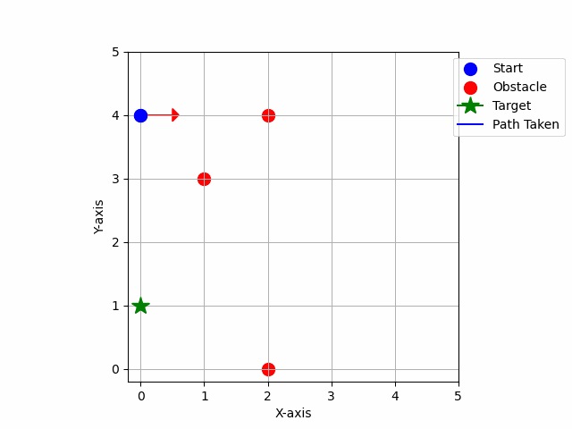

# Tabular RL-Based 2D Path Planning for UGV

This repository contains the implementation of a Tabular Reinforcement Learning (RL) approach for solving the problem of 2D path planning of an Unmanned Ground Vehicle (UGV) that tracks a moving target while avoiding fixed obstacles. The problem is addressed in a grid-based environment, where the UGV navigates to the target while also taking into account its heading and learning to avoid obstacles based on Q-learning algorithm.

## Table of Contents
1. [Presentation](#presentation)
2. [Problem Overview](#problem-overview)
3. [State and Action Space](#state-and-action-space)
4. [Q-learning Algorithm](#q-learning-algorithm)
5. [Installation](#installation)
6. [Hyperparameters](#hyperparameters)
7. [Experimental Results](#experimental-results)
8. [Directory Structure](#directory-structure)

## Presentation

You can view the presentation here: [PathSeeker](https://docs.google.com/presentation/d/1s4Lv9jcmNVO9f39mbx6Bxdi-Cp9ZhSgFOyTvQmg88jc/edit#slide=id.p)


## Problem Overview

The task is to design a UGV that can move through a 2D environment, tracking a moving target while avoiding fixed obstacles. The environment is represented as a 2D grid, where the UGV learns to plan its path using tabular RL. The UGV's objective is to reach the target position while avoiding collisions with obstacles.

- Objective: Train the UGV to move towards a dynamically changing target while avoiding obstacles placed in the grid.

## State and Action Space

- State Space: The state of the system is represented by the UGV's position (X, Y) and its orientation (Theta).
  - X, Y: UGV Position on a 2D grid.
  - Theta: UGV Orientation (direction) of the UGV, with possible values: [0, 90, 180, 270, 360] degrees.
  - $$\X_t\$$ , $$\Y_t\$$ : Target Position 
  
- Action Space: The UGV can take the following actions:
  - Move Forward: Move one grid cell forward.
  - Move Backward: Move one grid cell backward.
  - Turn Clockwise: Rotate 90 degrees clockwise.
  - Turn Counterclockwise: Rotate 90 degrees counterclockwise.

## Reward Function

The reward function for the Unmanned Ground Vehicle (UGV) is defined as follows:

$$
\
\text{Reward} =
\begin{cases} 
200, & \text{if } \| P_{UGV}^{S'} - P_{target} \| = 0 \\
-1000, & \text{if } P_{UGV}^{S'} \in \text{obstacles} \\
-(\theta_{UGV}^{S'} - \theta_{target}) - \| P_{UGV}^{S'} - P_{target} \|, & \text{otherwise}
\end{cases}
\
$$

Where:
- $$\ S' \$$, is the next state i.e. $$\ S_{t+1} \$$
- $$\ P_{UGV}^{S'} = (x_{UGV}', y_{UGV}', \theta_{UGV}') \$$, is the position and orientation of the UGV at state $$\ S' \$$
- $$\ P_{target} = (x_{target}, y_{target}) \$$, is the target position
- $$\ \text{obstacles}, \$$, refers to the obstacles encountered by the UGV on its path
- $$\ \theta_{target} \$$, is the angle from the UGV’s current position to the target position
- $$\ \| P_{UGV}^{S'} - P_{target} \| \$$, is the Euclidean distance between the UGV position in the next state $$\ S' \$$ and the target position
- $$\ (\theta_{UGV}^{S'} - \theta_{target}) \$$, is the angular difference between the UGV's orientation and the direction towards the target


## Q-learning Algorithm

The Q-learning update rule is given by the following equation:

$$
Q(S_t, A_t) \leftarrow Q(S_t, A_t) + \alpha \left[ R_{t+1} + \gamma \max_{a'} Q(S_{t+1}, a') - Q(S_t, A_t) \right]
$$

Where:
- $$\ Q(S_t, A_t) \$$, is the action-value function for the state $$\ S_t \$$ and action $$\ A_t \$$,
- $$\ \alpha \$$, is the learning rate (controls how much new information overrides the old),
- $$\ R_{t+1} \$$, is the reward received after performing action $$\ A_t \$$ in state $$\ S_t \$$,
- $$\ \gamma \$$, is the discount factor (how much future rewards are valued over immediate rewards),
- $$\ \max_{a'} Q(S_{t+1}, a') \$$, is the maximum predicted reward for the next state $$\ S_{t+1} \$$ over all possible actions $$\ a' \$$.

This equation is used to iteratively update the Q-values (action-value function) as the agent interacts with the environment.

## Installation

### Steps for Setup:

1. Clone the Repository:
   ```bash
   git clone https://github.com/R-Ahmed-Khan/PathSeeker.git

2. Requirements:
   ```bash
   cd PathSeeker/
   pip install -r requirements.txt

### Training and Testing Policy

1. **For training the policy:**
   ```bash
   cd PathSeeker/
   python3 run/run_q_learn.py --env_args "grid_size=5 | obstacles=[(1,3), (2,4), (2,0)]" --learn_args "epsilon=0.3 | gamma=0.95 | alpha=0.05 | episodes=400000"

The argument parameters are explained below. You can specify your own values while training (keeping the same format as specified).

- `--env_args`: Specifies the environment configuration for the agent.
- **`grid_size=5`**: Defines the size of the grid. Here, it's a 5x5 grid, meaning there are 5 rows and 5 columns where the agent will move.
- **`obstacles=[(1,3), (2,4), (2,0)]`**: Specifies the locations of obstacles within the grid. 

- `--learn_args`: Specifies the learning parameters for the Q-learning algorithm.
- **`epsilon=0.3`**: The exploration rate for the epsilon-greedy policy.
- **`gamma=0.95`**: The discount factor.
- **`alpha=0.05`**: The learning rate. 
- **`episodes=400000`**: The number of training episodes.

If you are first time installing this repository, you can test the policy with already trained model with the default commands provided below for testing the policy.

2. **For testing the policy:**

   ```bash
   cd PathSeeker/
   python3 run/run_policy.py --policy_args "start=(0, 4, 0) | targets=[(0,1),(3,1),(1,1),(2,1),(1,0),(3,0)]"

The argument parameters are explained below. You can specify your own values while testing (keeping the same format as specified).

- `--policy_args`: Specifies the testing parameters.
- **`start=(1, 2, 90)`**: The starting position of the agent in the environment, given by the tuple `(x, y, theta)`:
  - **`x=1`**: The starting x-coordinate on the grid.
  - **`y=2`**: The starting y-coordinate on the grid.
  - **`theta=90`**: The initial orientation of the agent, in degrees.
- **`target=[(2,3), (4,2), (1,2)]`**: A list of target locations that the agent should reach in sequence. Each target is represented by its `(x, y)` coordinates.
  - In this example, the agent needs to visit the points `(0,1), (3,1), (1,1), (2,1), (1,0), and (3,0)` in order. After reaching one target, the agent will try to move to the next target until all are visited.

## Hyperparameters

### Environment Parameters

Currently, the environment for the learning comprises of:

- Random Start and Target Positions
- Fixed Obstacles: [(3, 3), (2, 4), (2, 0)]
- Grid size: 5x5

### Learning Parameters

We have used the following learning parameters:

- Exploration rate: 0.3
- Learning rate: 0.05
- Discount Factor: 0.95
- Episodes: 400000

## Experimental Results

The policy was tested on following parameters:

- Start Position (x,y,theta) = (0, 4, 0)
- Target Positions (x,y) = [(0, 1), (3, 1), (1,1),(2, 1), (1, 0), (3, 0)]

It can be seen from the results that reward converges, hence the UGV tracks the moving target point while avoiding the obstacle.

### Reward History and Temporal Difference Error

<table>

  <tr>
    <td style="text-align: center; padding-right: 10px;">
      
      <p style="text-align: center;">Reward History vs Episodes</p>
    </td>
    <td style="text-align: center;">
      
      <p style="text-align: center;">Temporal Difference Error vs Episodes</p>
    </td>
  </tr> 
</table>

### UGV Path

The UGV tracks the moving target while changing its orientation to avoid obstacles.

<div align="center">
  
  <!--  -->
  

</div>

## Directory Structure

    PathSeeker/ 

        ├── analysis/ 

           ├── animate.py

           ├── plot_learning_data.py

           └── simulation.gif 
  
        ├── artifacts/ 

           ├── grid_size.csv 
  
           ├── obstacles.csv 
  
           ├── q_table.csv 
  
           ├── reward_history.csv

           ├── temp_diff_error.csv

           ├── rewards_history.png 
  
           └── temporal_difference_error.png 
  
        ├── run/ 

           ├── run_test_policy.py 
  
           └── run_q_learn.py 

        ├── src/ 

           ├── environment.py 
  
           ├── policy.py 
  
           ├── q_learning.py 
  
           └── utils.py 

        ├── requirements.txt 
   
        └── README.md
